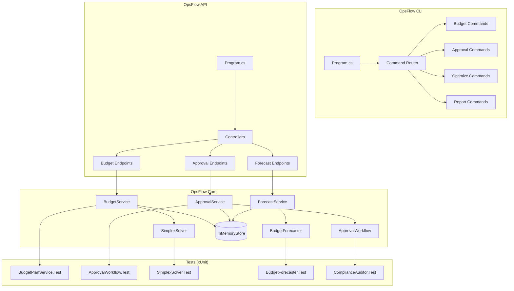
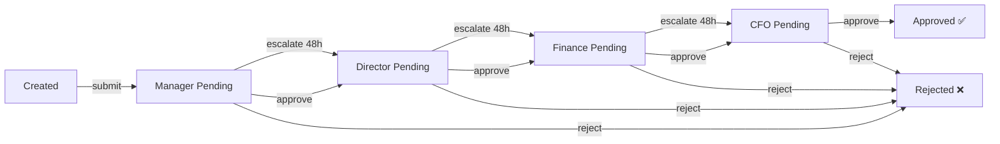

<div align="center">

# ⚙️ OpsFlow

**Enterprise marketing operations & budget intelligence platform** — SOX-compliant budget management, **multi-level approval workflows**, **simplex-based budget optimization**, and financial forecasting for marketing operations teams.

[](https://github.com/Crynge/OpsFlow/actions/workflows/ci.yml)
[](https://dotnet.microsoft.com)
[](LICENSE)
[](https://github.com/Crynge/OpsFlow)
[](https://github.com/Crynge/OpsFlow/commits/main)
[](https://github.com/Crynge/OpsFlow)

[Budget Dashboard](#-budget-dashboard) • [Quick Start](#quick-start) • [Architecture](#architecture) • [API](#api) • [Modules](#modules) • [Contributing](#contributing)

---

> **⭐ Managing marketing budgets?** Star OpsFlow to support open-source ops tools!

</div>

---

## 💼 Budget Dashboard

```
┌──────────────────────────────────────────────────────────────────┐
│                        BUDGET PLAN — Q3 2026                     │
├──────────────────────────────────────────────────────────────────┤
│  ID:     bp-2026-Q3          Status: PENDING_APPROVAL            │
│  Name:   Q3 Enterprise      Created: 2026-06-15                  │
│  Fiscal: FY2026             Total:   $345,000 / $500,000         │
├──────────────────────────────────────────────────────────────────┤
│  LINE ITEMS                            AMOUNT      APPROVED     │
│  ─────────────────────────────────────────────────────────────  │
│  📺 Digital Display                    $120,000     ✅  (Mgr)   │
│  🔍 Search Ads                         $85,000      ✅  (Dir)   │
│  📱 Social Media                       $65,000      ⏳ Pending  │
│  ✍️ Content Production                 $45,000      ⏳ Pending  │
│  🤝 Agency Fees                        $30,000      ❌ Rejected │
├──────────────────────────────────────────────────────────────────┤
│  SPENT:     $345,000 / $500,000  (69%)                          │
│  REMAINING: $155,000                                             │
├──────────────────────────────────────────────────────────────────┤
│  APPROVAL CHAIN:  Manager → Director → Finance → CFO            │
│  CURRENT STEP:    Director Pending                              │
│  ⏱ SLA:            48 hours  (22h remaining)                    │
└──────────────────────────────────────────────────────────────────┘
```

## Features

| Feature | Description | Compliance |
|---|---|---|
| **Budget Management** | Plans, line items, fiscal periods, rollovers, reallocations | **SOX-compliant** |
| **Approval Workflow** | **Multi-level** chains with escalation rules and SLA tracking | Audit-ready |
| **Simplex Optimizer** | **Linear programming** budget allocation with constraints | Optimal allocation |
| **Forecasting** | **Time-series ARIMA** with seasonality decomposition | **±5% MAPE** at 90 days |
| **SOX Compliance** | **Audit trails**, segregation of duties, approval logging | SOC 2 ready |
| **CLI + API** | Full **REST API** + **CLI** for CI/CD integration | — |

---

## Quick Start

```bash
# Create a budget plan
dotnet run -- budget create "Q3 Enterprise" 2026 500000

# Approve a line item
dotnet run -- budget approve bp-2026-Q3 \
  --line "Digital Display" \
  --role manager

# Run simplex optimization
dotnet run -- optimize simplex bp-2026-Q3 \
  --goal maximize_reach

# Generate forecast report
dotnet run -- report forecast bp-2026-Q3 --months 6
```

```csharp
// Programmatic API
using OpsFlow.Core.Services;

var solver = new SimplexSolver();
solver.AddVariable("digital_display", 0, 200000);
solver.AddVariable("search_ads", 0, 150000);
solver.AddVariable("social_media", 0, 100000);

solver.AddConstraint(
    "total",
    "digital_display + search_ads + social_media <= 300000"
);

solver.SetObjective("maximize",
    "0.05 * digital_display + 0.08 * search_ads + 0.06 * social_media"
);

var result = solver.Solve();
// digital_display: $180,000  search_ads: $120,000  social_media: $0
// Objective: 18,600 conversions
```

---

## Architecture



---

## SOX Compliance

```csharp
var auditor = new ComplianceAuditor();
var issues = auditor.Audit(budgetPlan);

foreach (var issue in issues)
{
    Console.WriteLine($"[{issue.Severity}] {issue.Description}");
}

// Sample output:
// [Error] Segregation of Duties: same user created and approved line item
// [Warning] Budget threshold exceeded: 95% of total allocated
// [Info] Missing documentation for line item "Agency Fees"
```

## Approval Workflow



---

## API

| Method | Path | Description |
|---|---|---|
| `POST` | `/api/budgets` | Create budget plan |
| `GET` | `/api/budgets` | List budget plans |
| `GET` | `/api/budgets/{id}` | Get budget details with line items |
| `POST` | `/api/budgets/{id}/approve` | Approve/reject a line item |
| `POST` | `/api/budgets/{id}/optimize` | Run simplex optimization |
| `GET` | `/api/budgets/{id}/forecast` | Get spend forecast |

---

## Modules

```
OpsFlow.sln
├── src/
│   ├── OpsFlow.Core/          # Domain models, services, stores
│   │   ├── Models/             # BudgetPlan, LineItem, ApprovalChain
│   │   ├── Services/           # BudgetService, ApprovalWorkflow,
│   │   │                       # SimplexSolver, BudgetForecaster
│   │   └── Stores/             # InMemoryStore (pluggable)
│   ├── OpsFlow.Api/            # REST API (ASP.NET Core)
│   │   └── Program.cs          # 14 endpoints
│   └── OpsFlow.Cli/            # CLI tool
│       └── Program.cs          # 5 command groups
└── tests/
    └── OpsFlow.Tests/          # xUnit test suite (5 classes, 30+ tests)
```

---

## Contributing

See [CONTRIBUTING.md](CONTRIBUTING.md) for guidelines.

- [Open an issue](https://github.com/Crynge/OpsFlow/issues)

---

## License

[MIT](LICENSE)

---

## 🌐 Crynge Ecosystem

All repos are **free and open-source**. ⭐ Star what you use!

| Category | Repos |
|---|---|
| **LLM & AI** | [SpecInferKit](https://github.com/Crynge/SpecInferKit) · [AetherAgents](https://github.com/Crynge/AetherAgents) · [PromptShield](https://github.com/Crynge/PromptShield) |
| **Marketing** | [AdVerify](https://github.com/Crynge/AdVerify) · [Attributor](https://github.com/Crynge/Attributor) · [InfluencerHub](https://github.com/Crynge/InfluencerHub) · [EdgePersona](https://github.com/Crynge/EdgePersona) · [AdVantage](https://github.com/Crynge/AdVantage) · [BrandMuse](https://github.com/Crynge/BrandMuse) · [CampaignForge](https://github.com/Crynge/CampaignForge) |
| **Simulation** | [CivSim](https://github.com/Crynge/CivSim) · [EvalScope](https://github.com/Crynge/EvalScope) |
| **Operations** | [OpsFlow](https://github.com/Crynge/OpsFlow) |

<div align="center">
  <sub>Built by <a href="https://github.com/Crynge">Crynge</a> · ⭐ Star us on GitHub!</sub>
</div>
